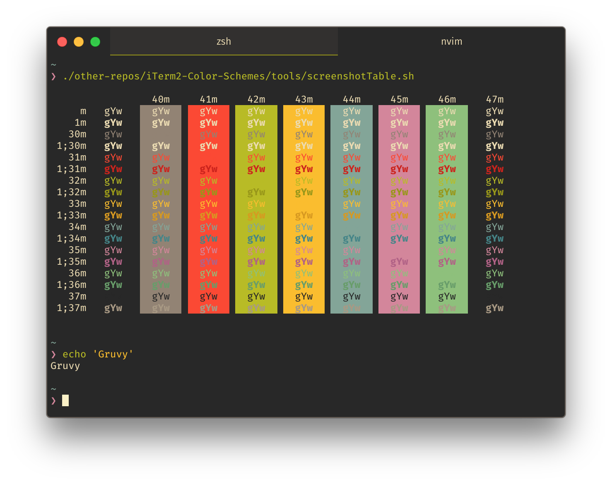

# hyperterm-gruvbox-dark

 

> Gruvbox [HyperTerm](https://hyperterm.org) theme

## Install

Add `hyperterm-gruvbox-dark` to the plugins list in your `~/.hyperterm.js` config file.

## Links

The [gruvbox](https://github.com/morhetz/gruvbox) vim theme.

See also [hyperterm-gruvbox](https://github.com/rezonanc/hyperterm-gruvbox) for more complete Hyper gruvbox theme.

## License

MIT © mcchrish.
